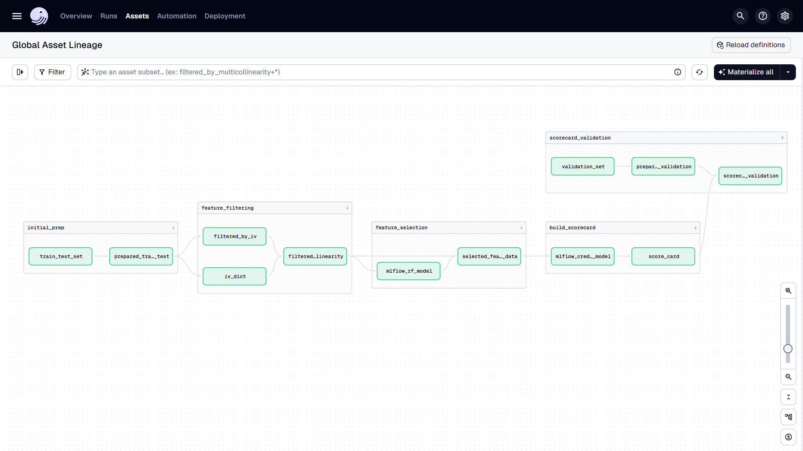

# Credit Scorecard Development

## Workflow

Implementasi end-to-end MLOps untuk development credit risk scorecard dengan Dagster, MLflow, dan OptBinning. Fokus project ini untuk exercise membangun production-ready ML system terlebih untuk case credit scorecard development. Sistem dibangun untuk mengotomasi flow development scorecard mulai dari data preparation hingga model monitoring.

Alur development dimulai dari preprocessing data dan feature engineering, dilanjutkan dengan feature selection menggunakan Information Value (IV) dan statistical test. Model yang digunakan adalah Logistic Regression yang kemudian ditransformasi menjadi scorecard menggunakan OptBinning. Setiap eksperimen di-track menggunakan MLflow untuk memastikan reproducibility, sementara orchestration pipeline menggunakan Dagster.

Validasi sistem dilakukan dengan Population Stability Index (PSI) analysis dan performance monitoring untuk memastikan scorecard yang dihasilkan reliable dan interpretable. Project ini juga bisa menjadi referensi untuk implementasi MLOps pada development credit scoring system secara end-to-end.

### Todo
- Model calibration & improvement
- Integrasi dengan Great Expectations untuk data quality monitoring dan validation di setiap stage data pipeline